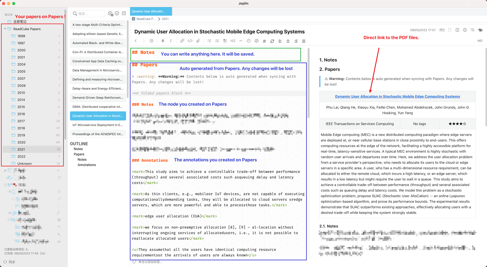

# Joplin Plugin Enhancement

> Generate from the Joplin plugin template: https://joplinapp.org/api/get_started/plugins/

It contains several enhancement for both codemirror and markdown renderer.

## Features

### ReadCube Papers

ReadCube Papers is a reference manager: [Official website](https://www.papersapp.com/).

This plugin supports:

1. Create one note for each paper in your library on Papers including the following content. They are grouped by the published year.
   1. title
   2. authors
   3. journal/conference name
   4. tags
   5. rating
   6. abstract
   7. user note
   8. user annotations
2. Each created note is named with the paper's title. You can update all the papers' information through the menu.
3. Direct link to the PDF file.



Each paper note has two parts:
* Joplin note part(the green box area): All the content in it will be saved
* Papers data part(the purple box area): All the content in it will be overwritten when syncing with Papers.

How to use:
1. In the Joplin Settings -> Joplin Enhancement -> Set your cookie for Papers
2. Joplin Menubar -> Tools -> Sync files with Papers: It will create notes for your papers without the annotations
3. Open one note: the annotation will be automatically updated. Or click the sync icon on the editor toolbar.

### Image

Allow following md works:

```markdown
{width=60%}
```

This plugin can:
* Specific the width/height of the image with `{width=80px}`, `{height=30}`, `{width=50%}`
* Render the image `` in a `<figure>` block with `figcaption`
* Use the `alt` attribute as the figure caption, and display the caption under the image if not empty
* Center alignment for image and caption
* Automatic image numbering


### Table

Auto add row/column, delete column, and format table.

> This part mainly comes from [takumisoft68: vscode-markdown-table](https://github.com/takumisoft68/vscode-markdown-table). Please refer to it for the feature description.
> I just convert the code from vscode's editor to joplin's codemirror. :)

Because I have no idea how to create a context menu, currently all the operations are triggered by shortcut:

|          Function          |          Shutcut          |
| :------------------------: | :-----------------------: |
|  Insert a row above/below  |  ctrl + shift + up/down   |
| Insert a column left/right | ctrl + shift + left/right |
|   Delete current column    | ctrl + shift + backspace  |
| Navigate to previous cell  |            tab            |
|   Navigate to next cell    |        shift + tab        |

1. It will automatically format your table code for alignment when navigation between cells with `tab`
2. A new line is appended when trying to navigate to next cell from the last cell

### Local file preview

Currently only local pdf file can be previewed.

### Quick Commands

Type `/command` in the editor for quick input of table, mermaid, etc.

* `/table`
* `/graph`
* `/flowchart`
* `/sequenceDiagram`
* `/gantt`
* `/classDiagram`
* `/erDiagram`
* `/journey`

### Auto folder in the editor

Currently only the mermaid block can be folded automatically.

## Build

### Building the plugin

The plugin is built using Webpack, which creates the compiled code in `/dist`. A JPL archive will also be created at the root, which can use to distribute the plugin.

To build the plugin, simply run `npm run dist`.

The project is setup to use TypeScript, although you can change the configuration to use plain JavaScript.

### Updating the plugin framework

To update the plugin framework, run `npm run update`.

In general this command tries to do the right thing - in particular it's going to merge the changes in package.json and .gitignore instead of overwriting. It will also leave "/src" as well as README.md untouched.

The file that may cause problem is "webpack.config.js" because it's going to be overwritten. For that reason, if you want to change it, consider creating a separate JavaScript file and include it in webpack.config.js. That way, when you update, you only have to restore the line that include your file.

## Thanks to

* [ylc395/joplin-plugin-note-link-system](https://github.com/ylc395/joplin-plugin-note-link-system)
* [takumisoft68/vscode-markdown-table](https://github.com/takumisoft68/vscode-markdown-table)
* [markdown-it](https://github.com/markdown-it/markdown-it/blob/master/lib/rules_inline/image.js)
* 