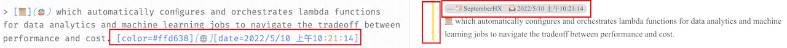
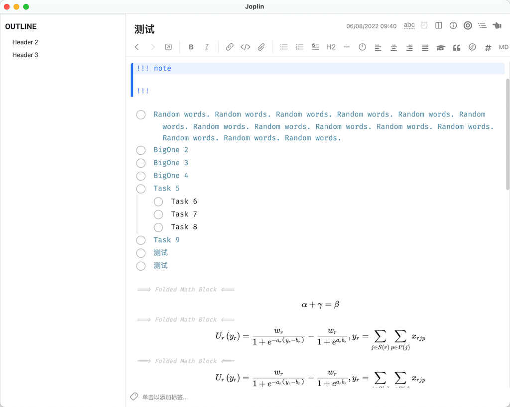
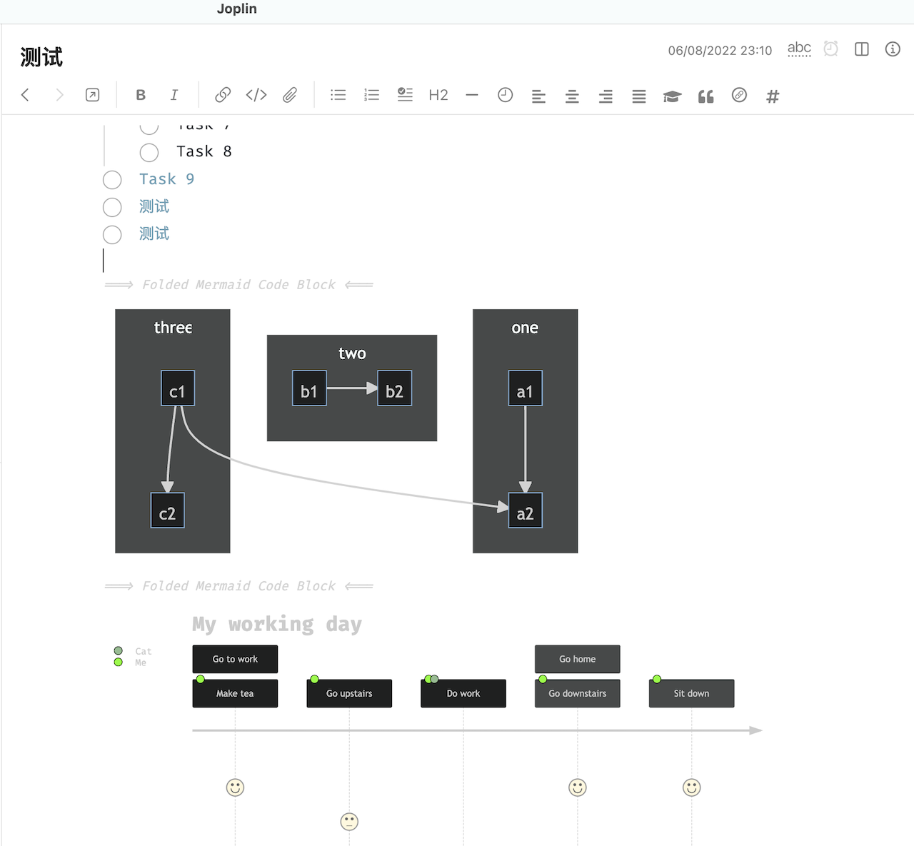
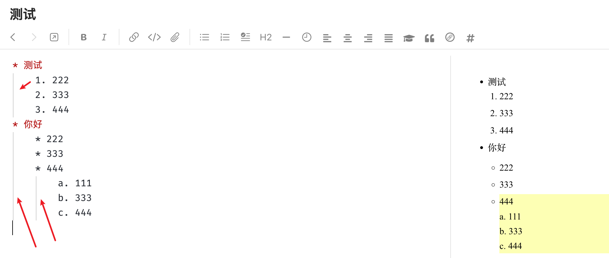
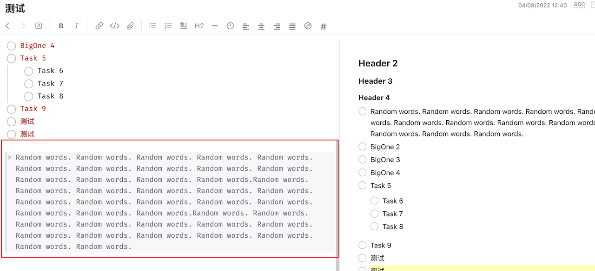
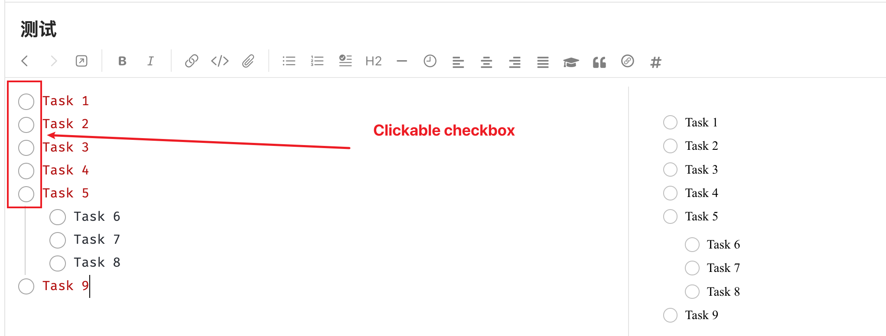
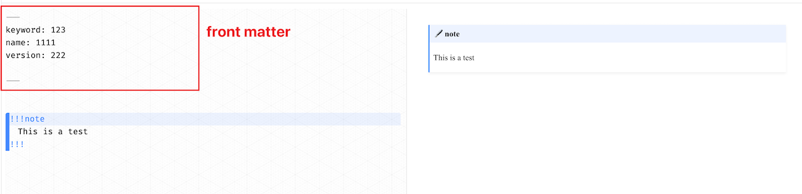
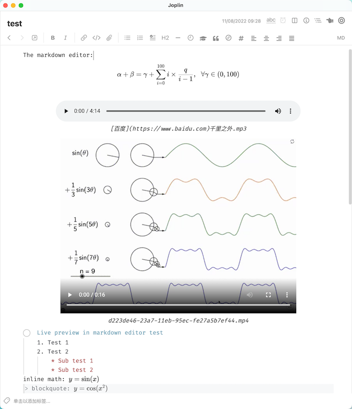

# Joplin Plugin Enhancement

[](https://www.buymeacoffee.com/septemberhx)

> Generate from the Joplin plugin template: https://joplinapp.org/api/get_started/plugins/

It contains several enhancement for both codemirror and markdown renderer.

## Features

### Pseudocode

Pseudocode block:


### Image

Allow following md works:

```markdown
{width=60%}
```

This plugin can:
* Specific the width/height of the image with `{width=80px}`, `{height=30}`, `{width=50%}`
* Render the image `` in a `<figure>` block with `figcaption`
* Use the `alt` attribute as the figure caption, and display the caption under the image if not empty
* Center alignment for image and caption
* Automatic image numbering


### Table

Auto add row/column, delete column, and format table.

> This part mainly comes from [takumisoft68: vscode-markdown-table](https://github.com/takumisoft68/vscode-markdown-table). Please refer to it for the feature description.
> I just convert the code from vscode's editor to joplin's codemirror. :)

Because I have no idea how to create a context menu, currently all the operations are triggered by shortcut:

|          Function          |          Shutcut          |
| :------------------------: | :-----------------------: |
|  Insert a row above/below  |  ctrl + shift + up/down   |
| Insert a column left/right | ctrl + shift + left/right |
|   Delete current column    | ctrl + shift + backspace  |
| Navigate to previous cell  |            tab            |
|   Navigate to next cell    |        shift + tab        |

1. It will automatically format your table code for alignment when navigation between cells with `tab`
2. A new line is appended when trying to navigate to next cell from the last cell

> Table column colorize from the plugin: [hieuthi/joplin-plugin-markdown-table-colorize](https://github.com/hieuthi/joplin-plugin-markdown-table-colorize)


### Admonition Renderer in markdown editor

It supports both `!!!` style and `:::` style admonitions.


### Enhanced blockquote support

* It supports `[color=red]` item in blockquote area so that the blockquote can be rendered with the given color border.
* `[name=SeptemberHX]` and `[date=20220202]`
* Automatically fold the `[xxx=xxx]` to keep the editor clean




### Inline/Block math renderer in markdown editor

> It significantly hurts your joplin's performance for now, especially with lots of math block. Please refer to https://github.com/laurent22/joplin/issues/6719

> Disabled by default




### Mermaid renderer in markdown editor



### Search & Replace

> Code mainly comes from https://github.com/zhuhs/codemirror-search-replace

> **Current Bug**: Cannot save after replacement. User needs to manually modify the note to save the change (for example: add a space)
> It is disabled by default


### Border for indent list in markdown editor

> It needs the joplin-rich-markdown plugin installed and the feature 'indent list' enabled



> Enable 'Add additional CSS classes for enhanced customization' in joplin-rich-markdown plugin to get rendered quote



### Clickable task checkbox in markdown editor

> Codes mainly comes from [Zettlr](https://github.com/Zettlr/Zettlr)



### Header tag render in markdown editor

> It shares the same configuration as with the clickable task checkbox

> Code mainly comes from **Zettlr**


### Toggle Sidebar and Note List panel together

A button on the note toolbar to toggle the sidebar and note list panel together.

It should be useful when the horizontal space of your screen is tight :)


### Render Front Matter to Nothing

It just renders the front matter to nothing. It is helpful when you try to keep the front matter part and avoid the unwanted rendered content.



### Local file preview

Currently only local pdf file can be previewed.

### Quick Commands

Type `/command` in the editor for quick input of table, mermaid, etc.

* `/table`
* `/graph`
* `/flowchart`
* `/sequenceDiagram`
* `/gantt`
* `/classDiagram`
* `/erDiagram`
* `/journey`
* `/now`
* `/tommorow`
* `/today`

### link/image/footnote renderer in the editor

> Only single line image/link can be previewed. ctrl/meta + left click on the rendered widgets can open the urls/files

> Link preview only works with PDF/video/audio files

> Inline link and image are folded only.




## Build

### Building the plugin

The plugin is built using Webpack, which creates the compiled code in `/dist`. A JPL archive will also be created at the root, which can use to distribute the plugin.

To build the plugin, simply run `npm run dist`.

The project is setup to use TypeScript, although you can change the configuration to use plain JavaScript.

### Updating the plugin framework

To update the plugin framework, run `npm run update`.

In general this command tries to do the right thing - in particular it's going to merge the changes in package.json and .gitignore instead of overwriting. It will also leave "/src" as well as README.md untouched.

The file that may cause problem is "webpack.config.js" because it's going to be overwritten. For that reason, if you want to change it, consider creating a separate JavaScript file and include it in webpack.config.js. That way, when you update, you only have to restore the line that include your file.

## Thanks to

* [ylc395/joplin-plugin-note-link-system](https://github.com/ylc395/joplin-plugin-note-link-system)
* [takumisoft68/vscode-markdown-table](https://github.com/takumisoft68/vscode-markdown-table)
* [markdown-it](https://github.com/markdown-it/markdown-it/blob/master/lib/rules_inline/image.js)
* [joplin/plugin-bibtex.git](https://github.com/joplin/plugin-bibtex.git)
* [CalebJohn/joplin-rich-markdown](https://github.com/CalebJohn/joplin-rich-markdown)
* [Zettlr/Zettlr](https://github.com/Zettlr/Zettlr)
