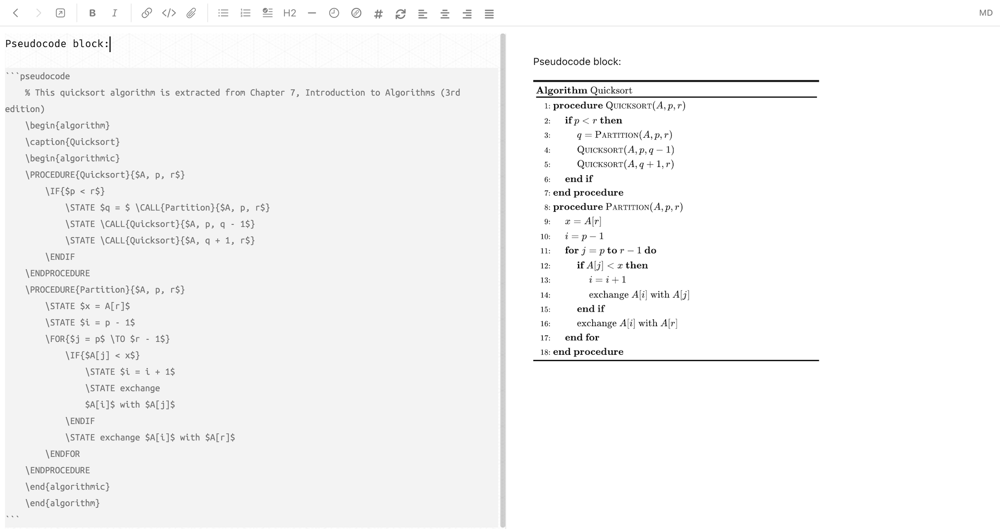
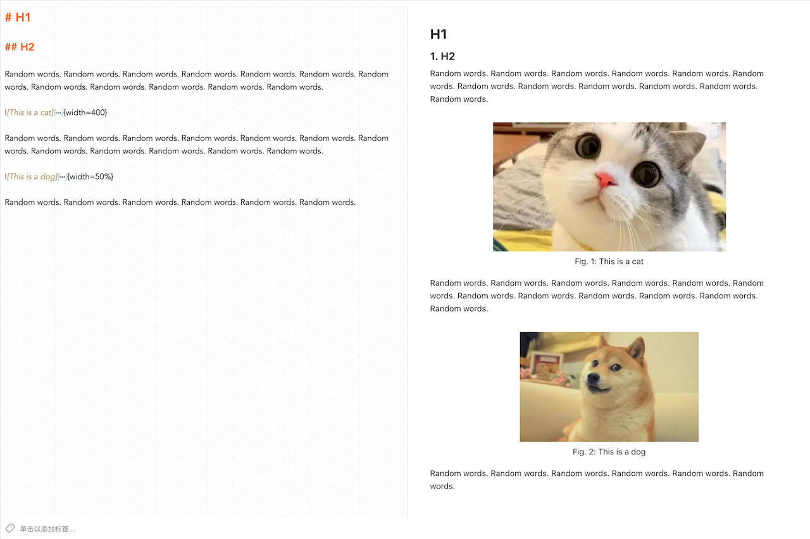
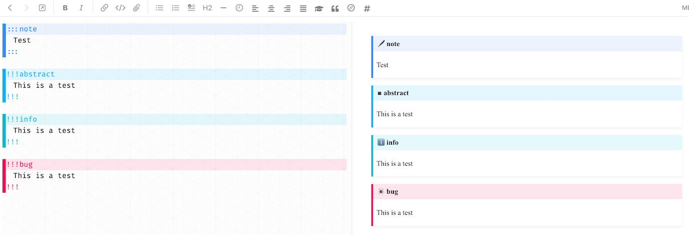
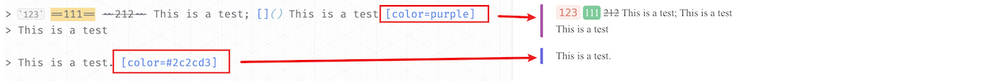

# Joplin Plugin Enhancement

> Generate from the Joplin plugin template: https://joplinapp.org/api/get_started/plugins/

It contains several enhancement for both codemirror and markdown renderer.

## Features

### Pseudocode

Pseudocode block:



### Image

Allow following md works:

```markdown
{width=60%}
```

This plugin can:
* Specific the width/height of the image with `{width=80px}`, `{height=30}`, `{width=50%}`
* Render the image `` in a `<figure>` block with `figcaption`
* Use the `alt` attribute as the figure caption, and display the caption under the image if not empty
* Center alignment for image and caption
* Automatic image numbering



### Table

Auto add row/column, delete column, and format table.

> This part mainly comes from [takumisoft68: vscode-markdown-table](https://github.com/takumisoft68/vscode-markdown-table). Please refer to it for the feature description.
> I just convert the code from vscode's editor to joplin's codemirror. :)

Because I have no idea how to create a context menu, currently all the operations are triggered by shortcut:

|          Function          |          Shutcut          |
| :------------------------: | :-----------------------: |
|  Insert a row above/below  |  ctrl + shift + up/down   |
| Insert a column left/right | ctrl + shift + left/right |
|   Delete current column    | ctrl + shift + backspace  |
| Navigate to previous cell  |            tab            |
|   Navigate to next cell    |        shift + tab        |

1. It will automatically format your table code for alignment when navigation between cells with `tab`
2. A new line is appended when trying to navigate to next cell from the last cell

> Table column colorize from the plugin: [hieuthi/joplin-plugin-markdown-table-colorize](https://github.com/hieuthi/joplin-plugin-markdown-table-colorize)


### Admonition Renderer in markdown editor

It supports both `!!!` style and `:::` style admonitions.

> It conflicts with the 'Align wrapped list items' of Rich Markdown plugin.

> This feature could be removed if the conflicts are solved, and it will be pushed to the Rich Markdown plugin. 



### Colorful blockquote support

It supports `[color=red]` item in blockquote area so that the blockquote can be rendered with the given color border.



### Local file preview

Currently only local pdf file can be previewed.

### Quick Commands

Type `/command` in the editor for quick input of table, mermaid, etc.

* `/table`
* `/graph`
* `/flowchart`
* `/sequenceDiagram`
* `/gantt`
* `/classDiagram`
* `/erDiagram`
* `/journey`
* `/now`
* `/tommorow`
* `/today`

### Auto folder in the editor

Currently only the mermaid block can be folded automatically.

## Build

### Building the plugin

The plugin is built using Webpack, which creates the compiled code in `/dist`. A JPL archive will also be created at the root, which can use to distribute the plugin.

To build the plugin, simply run `npm run dist`.

The project is setup to use TypeScript, although you can change the configuration to use plain JavaScript.

### Updating the plugin framework

To update the plugin framework, run `npm run update`.

In general this command tries to do the right thing - in particular it's going to merge the changes in package.json and .gitignore instead of overwriting. It will also leave "/src" as well as README.md untouched.

The file that may cause problem is "webpack.config.js" because it's going to be overwritten. For that reason, if you want to change it, consider creating a separate JavaScript file and include it in webpack.config.js. That way, when you update, you only have to restore the line that include your file.

## Thanks to

* [ylc395/joplin-plugin-note-link-system](https://github.com/ylc395/joplin-plugin-note-link-system)
* [takumisoft68/vscode-markdown-table](https://github.com/takumisoft68/vscode-markdown-table)
* [markdown-it](https://github.com/markdown-it/markdown-it/blob/master/lib/rules_inline/image.js)
* [joplin/plugin-bibtex.git](https://github.com/joplin/plugin-bibtex.git)
* [CalebJohn/joplin-rich-markdown](https://github.com/CalebJohn/joplin-rich-markdown)
